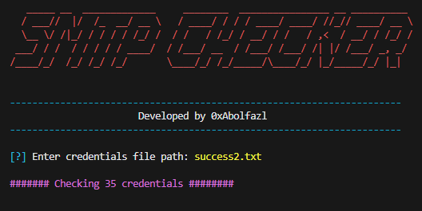
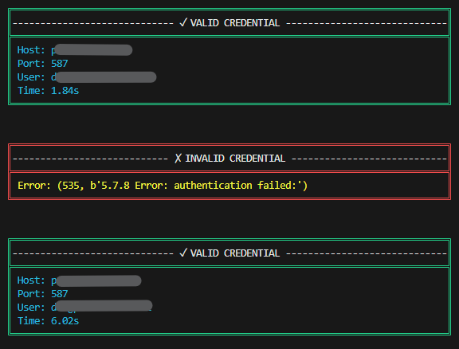

# SMTP Credentials Checker Tool 

A powerful Python script to validate SMTP credentials with colorful terminal output and visual feedback.

<p align="center">
  
</p>

## ✨ Features

- 🚀 **Multi-threaded checking** with animated loading
- 🎨 **Colorful terminal output** with `colorama`
- 📊 **Detailed results** for both valid and invalid credentials
- 💾 **Auto-save** valid credentials to `success.txt`
- ⏱️ **Response time measurement** for each check
- 🛡️ **Error handling** with clear error messages

## 🛠️ Installation
1. Clone Repository
```bash
git clone https://github.com/abolfazlrashidian/smtp-checker.git
```
2. Install Requirements
```bash
pip install -r requirements.txt
```

## 🚦 Usage
```bash
python smtp_checker.py
```
When prompted, enter the path to your credentials txt file 
* format in each line: host|port|username|password

## 📸 Screenshots
<p align="center">
  
</p>
<p align="center">
  
</p>